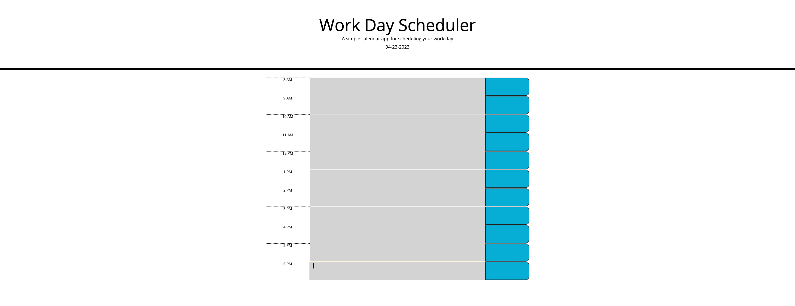

# Work Day Scheduler

For this assignment I created a scheduling application. 

- In this application users are able to see time slots for availble times during the work day.

- At the top of the webpage the current date is displayed.

- Times will become grey as the time slot shows a past time. 

- The current hour time slot will display red.

- The future time slots for hours that day will show green.

- Users will be able to enter information to each time slot and save it to local storage. 

## Webpage Link

Attached is a link to the deployed webpage.

[Work Day Scheduler Application Link](https://sethaphelps.github.io/Work-Day-Planner/)

## Screenshot of Webpage Design

Attached is a photo of the deployed webpage. 

